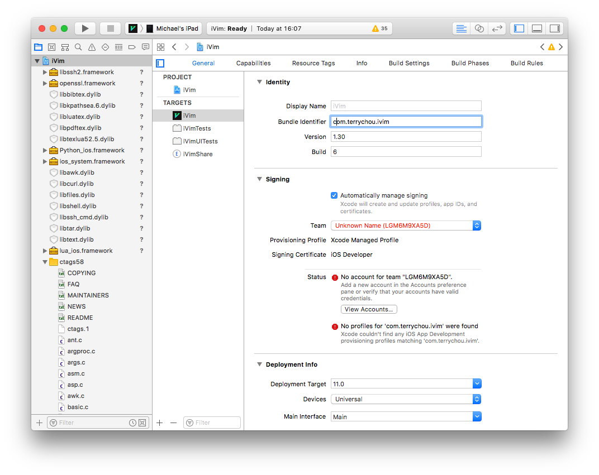
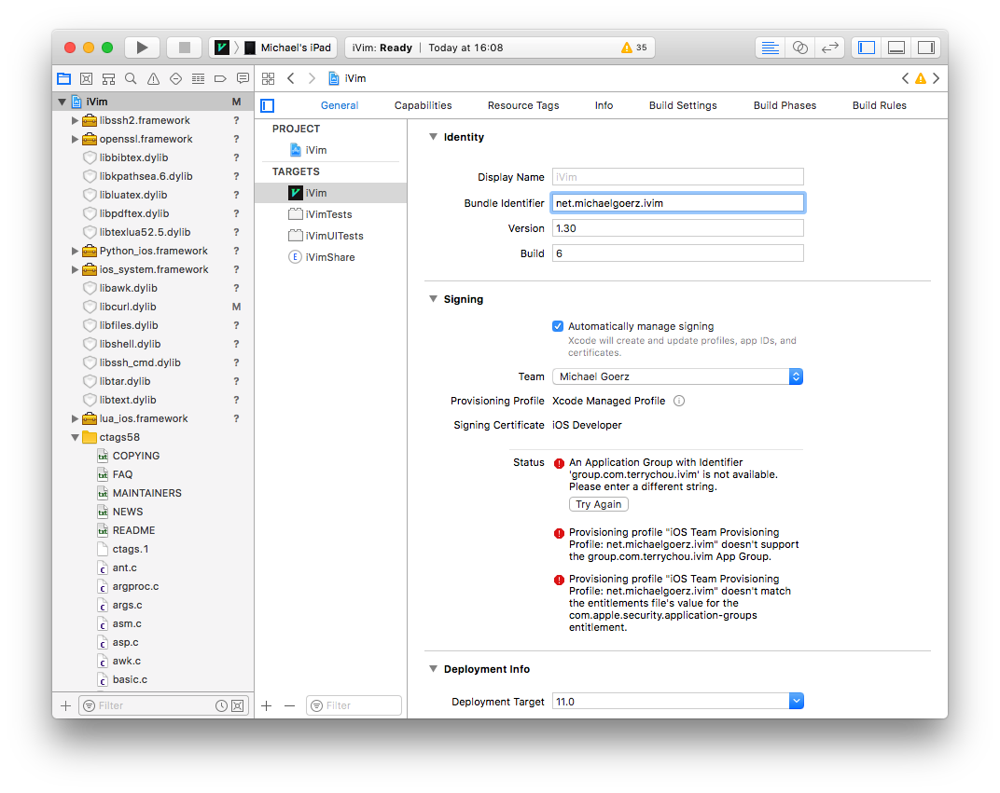
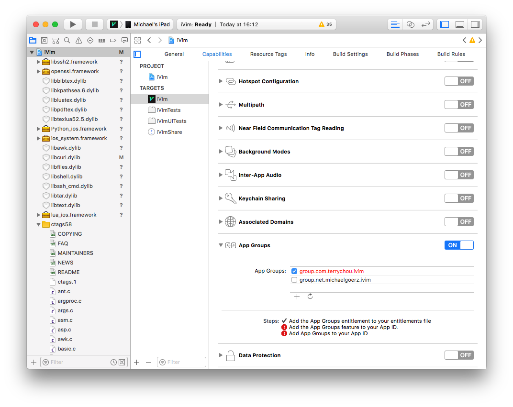
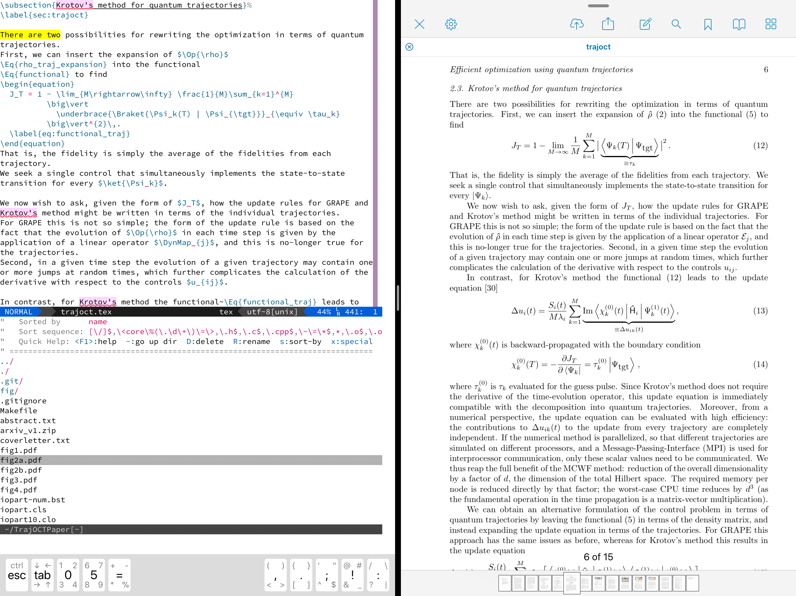

# Editing LaTeX on the iPad with iVim

Thanks to [Nicolas Holzschuch's](https://github.com/holzschu) heroic efforts in
creating [ios_system][], it is now possible to to have a full offline LaTeX
environment on an iPad centered around [vim], respectively a [fork][iVim fork] of
[Terry Chou's](https://github.com/terrychou) [iVim].

This is an alternative to [Texpad][] and [TeX Writer][], which are both very
good apps in their own right. However, nothing comes close to having a full vim
editor with all of your configuration, and an
[increasingly rich shell environment][ioscli], [ios_system][].

## Prerequisites

At the moment, the installation of the [iVim fork][] requires [sideloading][].
You will need to have a [Apple Developer Account][]. In principle, this works
with a free developer account. However, the resulting installation of iVim on
your iPad will only run for seven days. For this to be actually useful, you will
have to pay the 100 dollar yearly membership fee.

You will need [Xcode][] as well as an installation of [texlive][] on your Mac
(I'm assuming texlive 2017).

In the longer term, it is possible that [ios_system][] will be integrated into
the [App-store version of iVim][iVim app]. It may also be integrated in
[Blink][] and [OpenTerm][].

## Sideloading iVim

In order to sideload Nicolas Holzschuch's fork of iVim, follow his
[installation instructions](https://github.com/holzschu/iVim#how-to-install-it).
In short, do the following on your Mac:

    mkdir iVimWorkdir
    cd iVimWorkdir
    git clone git@github.com:holzschu/iVim.git  # tested with commit 76b1f56b14a0f8f6c2fa9fdcaa6cf14503f2b4c6
    cd iVim
    ./get_frameworks.sh

`iVimWorkdir` will now contain `iVim`, `lua_ios`, `python_ios`.

Connect your iPad to your Mac. Open `iVim/iVim.xcodeproj` in Xcode. You must
change the Bundle Identifier, the Signing Team, and the App Group to an arbitrary personalized setting.

Make sure you can see the "Targets".



For the iVim target, in "General", change the "Bundle Identifier" and the "Team"



Also, in "Capabilities", you must change the App Groups (deactivating
`group.com.terrychou.ivim` and activating your own personalized group instead)



The same changes are necessary for the other targets, especially "iVimShare".

Then, you can compile iVim and install it on the iPad by pressing the "Play"
button in Xcode.


## Configuring iVim

I use a [slightly trimmed-down version of my normal vim configuration](
https://github.com/goerz/vimrc/tree/ivim). You can clone this
configuration, create a tgz file of the resulting folder
(`tar -c vimrc | gzip > vimrc.tgz`),
and put that file e.g. in Dropbox (or some other cloud provider that you can
access from iOS). On the iPad, use the Files app to locate `vimrc.tgz` in
Dropbox, and use drag-and-drop to transfer it to the iVim sandbox. This is the
folder "On My iPad"/iVim.

Start iVim, and use vim's `netrw` feature (`:edit .`) to view files in
your "home directory". This is the directory you're in when you start iVim. It
is referenced by the `$HOME` environment variable; it's absolute path is
something like `/private/var/mobile/Containers/Data/Application/1CCC3068-0B64-41F0-85C6-CD732CB41BB1/Documents`.

Unpack the archive with `:!tar -xzf vimrc.tgz`. Rename
the resulting folder to `.vim` (`R` key in `netrw`). Move `.vim/init.vim` to
`.vimrc`, again using a "rename".

Restart iVim to make sure the vim configuration is active and doesn't cause any
errors.

Because of some sandboxing restrictions, the `.vimrc`
[must overwrite the following environment variables](https://github.com/holzschu/iVim#environment-variables):

```vim
" iVim fixes
let $PATH .= ':'.$HOME.'/../Library/bin:'.$HOME.'/bin'
let $PYTHONHOME = $HOME.'/../Library/'
let $SSH_HOME = $HOME
let $CURL_HOME = $HOME
let $SSL_CERT_FILE = $HOME.'/cacert.pem'
let $HGRCPATH = $HOME.'/.hgrc'
```

iVim has support for mapping to the command key on the Apple Smart Keyboard,
which makes the following settings useful:

```vim
map <D-o> :idocuments <CR>
map <D-e> :edit . <CR>
map <D-s> :w <CR>
map <D-t> :tabnew <CR>
map <D-w> :bd <CR>
map <D-q> :quit <CR>
map <D-}> :tabne <CR>
map <D-{> :tabprev <CR>
```

Lastly, I prefer to have black text on a white background. My [custom
colorscheme](https://github.com/goerz/vimrc/blob/ivim/colors/goerz.vim) assumes
that the terminal emulator has the correct background color. At the moment, iVim
only has white text on a black background, so I must force the correct
background in the `vimrc`, in addition to loading my color scheme:

```vim
set background=light
colorscheme goerz
hi Normal ctermbg=White ctermfg=Black guifg=Black guibg=White
```


## Copying the texlive distribution

On your Mac, create an archive of your texlive folder (`/usr/local/texlive`),
which should contain a subfolder `2017` (or whatever release of texlive you have
installed), and `texmf-local`.

```bash
cd /usr/local
sudo tar -c texlive | gzip > ~/texlive.tgz
```

Again, put the tgz file in Dropbox, and transfer it to the iVim sandbox with
drag-and-drop in the Files app. Unpack it in `$HOME/../Library`. When you're
done, you should have a `texlive` folder at the absolute path
`/private/var/mobile/Containers/Data/Application/9CCC3068-0B63-40F0-85C6-CD632CA41BB1/Library/texlive`
which contains a subfolder `2017` and `texmf-local`. It is very important to get
these files into the correct location. Otherwise, when trying to use LaTeX (see
below), absolutely nothing will happen (no generated files, but also no error
messages). This was my biggest hangup in getting the system to work.

[You may also want to transfer `/usr/lib/python2.7/`.](https://github.com/holzschu/blink#additions)

## Using LaTeX

Copy the "project folder" that contains your tex/bib/figure files into the iVim
sandbox. I recommend using [Working Copy][] (a git client for iOS). You can
check out a project from [Overleaf][] in Working Copy and then edit that offline
in iVim! The repositories that you've checked out in Working Copy will be visible in the
Files app. You can drag-and-drop the project folder to the iVim sandbox to copy it there.
For this example, I will assume the project folder is `TrajOCTPaper`. Then,

*   Start iVim

*   `:cd TrajOCTPaper`. This makes sure that your working directory is the project folder.

*   `:edit .` to open the `netrw` file manager in iVim

*   Navigate to the file you want to edit, e.g. `trajoct.tex`, and press enter to load it

*   Edit as desired

*   Compile with `:!pdflatex %`. You can also do e.g. `:!bibtex trajoct`, as
    necessary


When you're done, you may use the Files app to drag the project folder back to
Working Copy, overwriting the original folder. This will make your changes
available to be committed in Working Copy.


## PDF Viewer

You can use [PDF Viewer][] to view the pdf file resulting from your compilation
side-by-side with iVim (in split view). PDF Viewer allows to open the pdf file
directly from the iVim sandbox. It has the unique ability to detect changes in
the pdf (from recompiling it), and will automatically update its display.



[vim]: http://www.vim.org
[iVim fork]: https://github.com/holzschu/iVim
[iVim]: https://github.com/terrychou/iVim
[iVim app]: https://itunes.apple.com/us/app/ivim/id1266544660?mt=8
[Texpad]: https://www.texpad.com/ios
[TeX Writer]: https://apps.texwriter.net
[ios_system]: https://github.com/holzschu/ios_system#ios_system-drop-in-replacement-for-system-in-ios-programs
[sideloading]: https://bou.ke/blog/sideload-iphone/
[Apple Developer Account]: https://developer.apple.com
[Xcode]: https://developer.apple.com/xcode/
[texlive]: http://tug.org/texlive/
[Blink]: http://www.blink.sh
[OpenTerm]: https://github.com/louisdh/terminal
[Working Copy]: https://workingcopyapp.com
[PDF Viewer]: https://itunes.apple.com/us/app/pdf-viewer-by-pspdfkit/id1120099014
[Overleaf]: https://www.overleaf.com
[ioscli]: http://maverick.inria.fr/Members/Nicolas.Holzschuch/ios_shell.html
