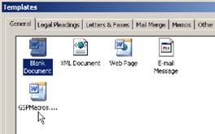
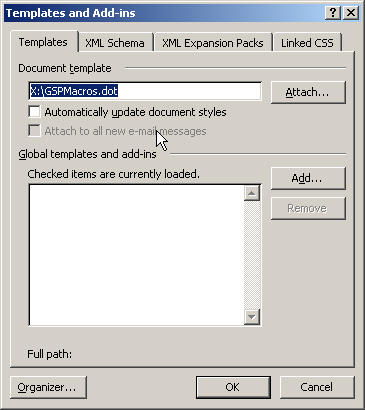
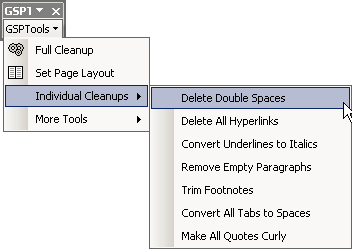
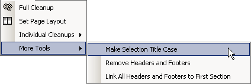

# GSP Tools Macro Set

I wrote a collection of macros for MSWord to aid in formatting documents for
Global Scholarly Publications journals.

The GSP Tools Macro Set contains
 * A number of MS Word 2003 macros that assist in formatting GSP material
 * A menu bar that gives access to the macros.
 * A number of standard styles that should be used for GSP journals

#### Download ####

* [GSPMacros.dot](gspmacros.dot)

#### Installation and Template Use ####

* Download the .dot-template file above. You can put it in your default
  template folder if you like, which is usually at
  `C:\Documents and Settings\username\Application Data\Microsoft\Templates`
* Create New File from the Template.
  If you saved the template in the default template folder, you can got to
  `File > New` and then click on `On my computer` in the Templates-section
   of the appearing sidebar. The template should appear in the list there.

Alternatively, if you did not save in the default location, you can go to you
hard drive and double click the template file. This will automatically create a
new Word file.

#### Apply Template to Existing File ####

If you are working on an existing file, e.g. an article that needs to be
cleaned up, and you would like to use the macros and styles of the GSP Macro
Set, you can do the following:

* Go to Tools &gt; Templates and Add-Ins, click on "Attach" and select the template file

  

* If you would like to use the styles in the template, check "Automatically
  update document styles". This may cause a lot of clutter in the Styles and
  Formatting list, however, since the document will retain its current
  formatting, and created modified styles to accommodate that.
* For importing or exporting Styles or Macros from the template file to any
  other Word document, you can use the Organizer tool which you find at the
  bottom of the Templates and Add-Ins dialog.

If everything went fine while applying the template, you should now have the
macros at your disposal.

Also, the GSPTools toolbar should be visible (or you may have to enable it).

All macros can be accessed from the menu in the toolbar. The most important
macro is "FullCleanup", which executes everything in the
Individual-Cleanups-submenu. The function of all other macros should be pretty
self-explanatory from their menu names.
