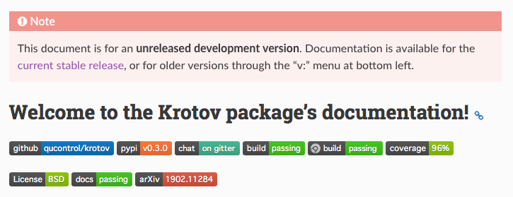

# Showing a warning for the "latest" documentation on ReadTheDocs

By default, [ReadTheDocs (RTD)][1] shows the 'latest' version of a package's Sphinx-generated documentation that tracks the master branch. This can be confusing to users, who most likely will have the most recent release of the package installed. Thus, they may see something in the documentation that is specific to unreleased features, and does not match up with the version of the package they have installed. A similar problem is with people seeing the documentation for an old release (most likely through a link on Google).

There are two builtin-settings on RTD that help with this, and that should be enable for any package that has had a "stable" release:

*   Show the "stable" version by default: in the RTD "Admin" tab, select "Advanced Settings" and switch "Default version" from "latest" to "stable"

*   Show warnings for old version: In the same "Advanced Settings", check the "Show version warning" box

This still leaves the problem of the unstable 'latest' version of the documentation. We can solve the problem by adding some custom javascript to the Sphinx documentation:

*   Put [the `version-alert.js` file][2] into the `docs/_static` subfolder of your project (credit: [django-anymail][3])

*   Load the javascript by [adding the following in `docs/conf.py`][4]:

    ```python
    def setup(app):
        # ...
        app.add_javascript("version-alert.js")
    ```

See the [documentation of the `krotov` package][5] for an example of how this looks:



An alternative approach would be to insert the warning statically via a [plugin][6], but the javascript method works much better, most importantly because it is able to include a link to the current "stable" version of the same page. There is also a ["sphinx-version-warning" plugin][7], but as far as I can tell, this was just a prototype to the builtin "Show version warning" option on RTD; I was not able to use it to show a warning on 'latest'.

[1]: https://readthedocs.org
[2]: https://github.com/qucontrol/krotov/blob/969fc980346e6411903de854118c48c51208a810/docs/_static/version-alert.js
[3]: https://github.com/anymail/django-anymail/blob/4c443f5515d1d5269a95cb54cf75057c56a3b150/docs/_static/version-alert.js
[4]: https://github.com/qucontrol/krotov/blob/969fc980346e6411903de854118c48c51208a810/docs/conf.py#L321
[5]: https://krotov.readthedocs.io/en/latest/
[6]: https://gist.github.com/goerz/9be64b2a8d9a569d8586def1259685f0
[7]: https://github.com/humitos/sphinx-version-warning
