# The "U.S. International - Scientific" Keyboard Layout

I routinely find myself having to type a lot unicode symbols on US keyboards on macOS, both for accented characters in European languages (umlauts) and for various "math". There is a ["U.S. International - PC" keyboard layout](https://apple.stackexchange.com/questions/120938/wheres-the-us-international-keyboard-on-os-x-10-9-mavericks) that purports to provide accented characters, but I find it to be a bit cumbersome for the accents I type most frequently (German umlauts). Moreover, it does not address the need for "scientific" unicode symbols.

In my default text editor, [vim](https://neovim.io), I have both the option to use [digraphs](http://vimdoc.sourceforge.net/htmldoc/digraph.html) and the  [`julia-vim` plugin](https://github.com/JuliaEditorSupport/julia-vim) to conveniently type out the [extensive unicode symbols](https://docs.julialang.org/en/v1/manual/unicode-input/) used in the [Julia](https://docs.julialang.org) language. The latter is in fact my *preferred* way to type unicode, even beyond Julia. I've gone so far as to have a [KeyboardMaestro](https://www.keyboardmaestro.com/main/) macro that copies the text of a web form, pastes it into a temporary file that it opens in vim, waits for vim to quit, and pastes the content of the file back into the web form.

Still, there are lots of situations were round-tripping through vim is inconvenient, and it would be nice to be able to type unicode *directly*. Instant messaging (Slack/Discord) is a typical situation where I often want to type "unicode-math". Thus, using [Ukelele][], I created a keyboard layout "U.S. International - Scientific for macOS. The default keys are the standard US layout:

[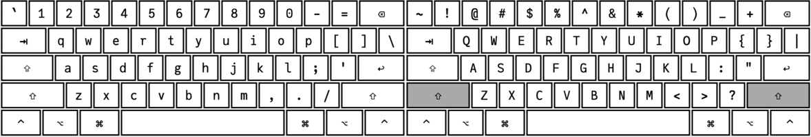](us_scientific_normal.png)

Unicode symbols are accessed through the alt ("option") key ⌥:

[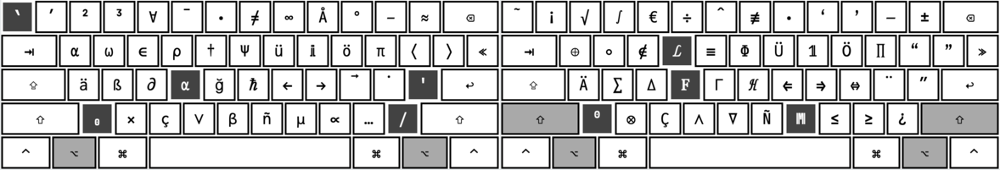](us_scientific_alt.png)

The following is a complete list of all the supported characters. It obviously skews to my personal use case of most frequently used symbols, and thus heavily favors symbols occurring in quantum physics.

Lowercase keys:

* ``⌥` `` — dead key for grave (see below)
* `⌥1` — prime mark (`′`)
* `⌥2` — square (`²`)
* `⌥3` — cube (`³`)
* `⌥4` — logical for-all symbol (`∀`)
* `⌥5` — over-bar for the previous character, e.g. `z⌥5` will result in `z̅`. Notation for a complex conjugate.
* `⌥6` — dot (inner product) operator (`⋅`)
* `⌥7` — not-equal sign (`≠`). Operator in Julia.
* `⌥8` — infinity (`∞`)
* `⌥9` — Angstrom sign (`Å`)
* `⌥0` — Degree sign (`°`)
* `⌥-` — en-dash (`–`)
* `⌥=` — almost equal-to (`≈`)
* `⌥q` — Greek letter alpha (`α`)
* `⌥w` — Greek letter omega (`ω`), used for angular frequencies
* `⌥e` — Element-of sign (`∈`), not to be confused with Greek epsilon (`ϵ`) / var-epsilon (`ε`)
* `⌥r` — Greek letter rho (`ρ`), used for density matrices in quantum mechanics
* `⌥t` — Dagger (`†`), used to denote the complex conjugate in quantum mechanics. Not as useful as it could be, since this is not available a superscript
* `⌥y` — Greek letter capital-Psi (`Ψ`), used to denote state vectors in quantum mechanics
* `⌥u` — German umlaut ü
* `⌥i` — Double-struck i, (`𝕚`), used for the imaginary unit
* `⌥o` — German umlaut ö
* `⌥p` — Greek letter pi (`π`)
* `⌥[` — Left angle bracket (`⟨`), used for "Bra's" in quantum mechanics (`⟨Ψ|`)
* `⌥]` — Right anlge bracket (`⟩`), use for "Ket's" in quantum mechanics (`|Ψ⟩`)
* `⌥\` — Much-less-than sign (`≪`)
* `⌥a` — German umlaut ä
* `⌥s` — German sharp-s (`ß`), not to be confused with Greek beta (`β`)
* `⌥d` — Symbol for the (partial) derivative, (`∂`)
* `⌥f` — dead key for Greek letters (see below)
* `⌥g` — Letter g with breve (`ğ`), common in Turkish name
* `⌥h` — reduced Planck's constant (`ℏ`)
* `⌥j` — left-arrow (`←`)
* `⌥k` — right-arrow (`→`)
* `⌥l` — over-arrow ("vector"), for previous characters
* `⌥;` — over-dot for previous character, e.g., `x⌥;` will result in `ẋ`, indicating a time derivative.
* `⌥'` — dead key for acute accent (see below)
* `⌥z` — dead key for sub-script (see below)
* `⌥x` — cross-product (`×`), most commonly used in e.g. `3×10⁻³`
* `⌥c` — c with cedilla (`ç`), common in Spanish names
* `⌥v` — logical or (`∨`)
* `⌥b` — Greek letter beta (`β`)
* `⌥n` — n with tilde (`ñ`), common in Spanish names
* `⌥m` — Greek letter mu (`µ`), common unit-prefix, e.g., `μm`
* `⌥,` — Proportional-to sign (`∝`)
* `⌥.` — Ellipsis (`…`)
* `⌥/` — dead key for slash-through characters e.g, `ø` (see below)

Uppercase keys:

* ``⌥⇧` `` — over-tilde for previous character, e.g. ``S⌥⇧` `` is `S̃`, denoting a Fourier transform or other "transformed"/"alternative" quantity
* `⌥⇧1` — inverted exclamation point (`¡`), Spanish punctuation
* `⌥⇧2` — square root sign (`√`)
* `⌥⇧3` — integral sign (`∫`)
* `⌥⇧4` — Euro currency sign (`€`)
* `⌥⇧5` — division sign (`÷`), integer division in Julia
* `⌥⇧6` — hat for previous character, e.g. ``H⌥⇧6``, results in `Ĥ`, denoting a Hilbert space operator
* `⌥⇧7` — not-identical-to sign (`≢`), operator used in Julia
* `⌥⇧8` — dot operator (`⋅`)
* `⌥⇧9` — left single typographical quotation mark (`‘`)
* `⌥⇧0` — right single typographic quotation mark (`’`)
* `⌥⇧-` — em-dash (`—`)
* `⌥⇧=` — plus-minus sign (`±`)
* `⌥⇧q` — circled-pulse operator (`⨁`), "direct sum" in quantum mechanics
* `⌥⇧w` — ring operator (`∘`), function composition in Julia
* `⌥⇧e` — not-element-in sign (`∉`), operator in Julia
* `⌥⇧r` — dead key for script characters (see below)
* `⌥⇧t` — identical-to-sign (`≡`), operator in julia
* `⌥⇧y` — Greek uppercase Phi (`Φ`)
* `⌥⇧u` — German umlaut Ü
* `⌥⇧i` — Double-struck digit 1 (`𝟙`), used for the identity operator
* `⌥⇧o` — German umlaut Ö
* `⌥⇧p` — Product sign (`∏`), not to be confused with Greek Pi (`Π`)
* `⌥⇧[` — left double typographical quotation mark (`“`)
* `⌥⇧]` — right double typographical quotation mark (`”`)
* `⌥⇧\\` — much-greater-than sign (`≫`)
* `⌥⇧a` — German umlaut Ä
* `⌥⇧s` — Sum sign (`∑`), not to be confused with Greek Sigma (`Σ`)
* `⌥⇧d` — Greek letter uppercase Delta (`Δ`)
* `⌥⇧f` — dead key for bold characters (see below)
* `⌥⇧g` — Greek letter uppercase Gamma (`Γ`)
* `⌥⇧h` — Script capital H (`ℋ`), "Hilbert space" in quantum mechanics
* `⌥⇧j` — Double left arrow (`⇐`)
* `⌥⇧k` — Double right arrow (`⇒`) ("implies")
* `⌥⇧l` — Double left-right arrow (`⇔`), "logically equivalent"
* `⌥⇧;` — double-dot (diaeresis) for previous characters, e.g. `x⌥⇧;` results in `ẍ`, a second time derivative.
* `⌥⇧'` — double prime mark (`″`)
* `⌥⇧z` — dead key for super-script (see below)
* `⌥⇧x` — Kronecker product (`⊗`)
* `⌥⇧c` — capital C with cedilla (`Ç`)
* `⌥⇧v` — logical and (`∧`)
* `⌥⇧b` — Nabla (`∇`), used to denote gradients
* `⌥⇧n` — capital N with tilde (`Ñ`)
* `⌥⇧m` — dead key for double-struck letters (see below)
* `⌥⇧,` — less-than-or-equal sign (`≤`)
* `⌥⇧.` — greater-than-or-equal sign (`≥`)
* `⌥⇧/` — inverted question mark (`¿`), Spanish punctuation
* `⌥⇧<space>` — non-breaking space

The keys with a dark-gray background are "dead" keys that wait for the next key press, effectively entering a different keyboard mode:

*  — type a letter with "acute" accent
*  — type a letter with "grave" accent
* 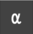 — type a Greek (or Hebrew) letter
*  — type a subscript
*  — type a superscript
*  — type a letter with a slash-through
*  — type a letter from the "Script" mathematical alphabet
*  — type a letter from the "Bold" mathematical alphabet
*  — type a letter from the "Double-struck" mathematical alphabet

All of these "modes" will be detailed below

## Accented characters

There's two categories of keys resulting in accented characters. Unicode has ["combining diacritical marks"](https://en.wikipedia.org/wiki/Combining_Diacritical_Marks) that apply an accent to the previous keys. This is particularly useful for "math accents" such as dots, tilde, or hats, since these can be combined with *any* previous character. We have the following combining accents mapped directly to keys.

* over-bar, mapped to `⌥5`
* over-arrow (vector), mapped to `⌥l`
* over-dot (time derivative), mapped to `⌥;`
* over-double-dot (second time derivative), mapped to `⌥⇧;`
* over-tilde, mapped to ``⌥⇧` ``
* over-hat, mapped to `⌥⇧6`

For a few other accents that are primarily used for names in European languages, but not as match accents, we use dead keys (where the key indicating the mark is pressed *first*):

*   "acute" accent, by pressing 

    [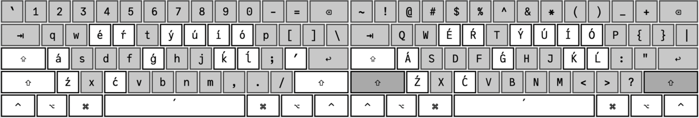](us_scientific_acute.png)

*   "grave" accent, by pressing 

    [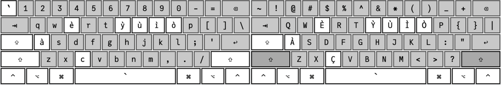](us_scientific_grave.png)

*   "slash-through", by pressing 

    [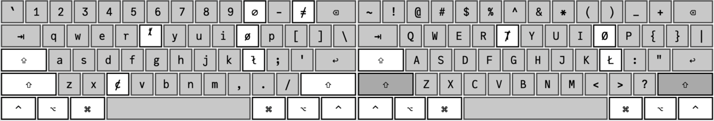](us_scientific_slash.png)

This is in addition to some very commonly used accented characters like umlauts that are accessible *directly*.

## Sub- and Superscripts

*   Subscript, by pressing 

    [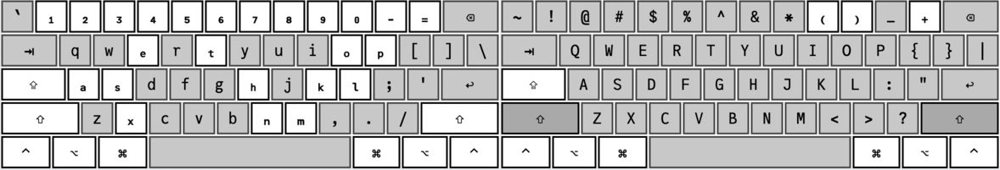](us_scientific_subscript.png)

*   Superscripts, by pressing 

    [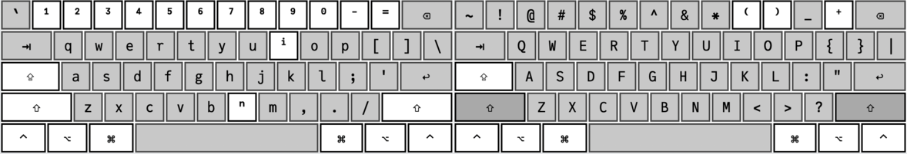](us_scientific_superscript.png)

[Unfortunately](https://twitter.com/fairbanksjp/status/1401281556451192834), the unicode standard  does not provide a full alphabet of super-/sub-scripts. Hopefully, this will [change](https://github.com/stevengj/subsuper-proposal) at some point in the future.

## Greek characters

*   Greek letters can be accessed by by pressing 

    [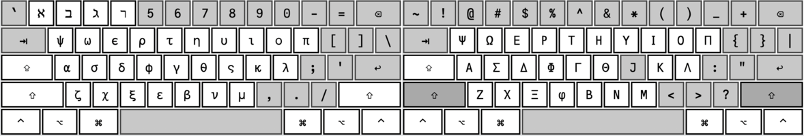](us_scientific_greek.png)

* This includes the first few letters of the Hebrew alphabet, which are sometimes used in mathematics

* Note that there is epsilon (`ϵ`) and var-epsilon (`ε`), as well as phi (`ϕ`) and var-phi (`φ`). These are sometimes use with different meanings in math. Whether it is a good idea to mix them in the same text/code would be a matter of debate.

* The alternative end-of-word sigma (`ς`), isn't very commonly used in science, but if you ever find yourself having to type actual ancient Greek, it might come in handy.

## Mathematical alphanumeric symbols

The unicode standard defines [several alternative styles for math alphabets](https://en.wikipedia.org/wiki/Mathematical_Alphanumeric_Symbols). A few of them are supported via dead keys.

*   Double-struck letters, by pressing . I use these somewhat frequently to denote standard number sets (`ℂ`), or the identity operator (`𝟙`)

    

*   Bold letters, by pressing . I use these sometimes to denote vectors. For *classical vectors*, I usually prefer `v⃗`, but I might write e.g. `𝐉̂` for an angular-momentum operator.

    [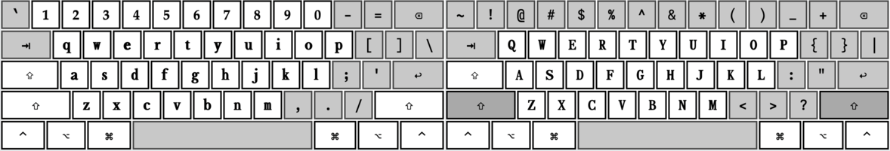](us_scientific_mathbold.png)

*   Script letters, by pressing . I sometimes use these for operators in Liouville space.

    [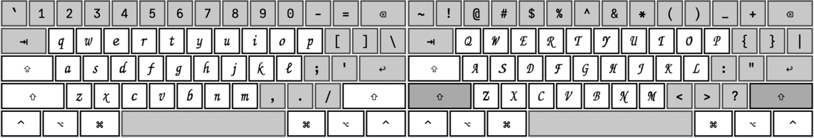](us_scientific_mathscript.png)

## Installation

You can install the keyboard layout by downloading

[USScientific.bundle.zip](USScientific.bundle.zip)

and placing the resulting `bundle` file either in `/Library/Keyboard Layouts`
(system-wide installation) or `~/Library/Keyboard Layouts` (user installation).
You can also open the bundle in [Ukelele][]  and use the "Install" option from
the "File" menu (and of course adapt the layout for your needs).

After installation, the layout should be available in the Keyboard System
Preferences, in "Input Sources", as "U.S. International - Scientific".

The layout is also available on [Github](https://github.com/goerz/USScientific.bundle).

Bonus tip: for figuring out what exactly a given unicode character is in the
keyboard layout, type it out in Vim with the [characterize vim plugin](https://github.com/tpope/vim-characterize)
installed, put the cursor on top of it, and us the `ga` command.

[Ukelele]: http://ipython.readthedocs.io/en/stable/whatsnew/version3.html#typing-unicode-identifiers
