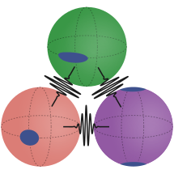
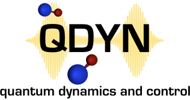
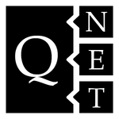

# Programming

On Github:

<i class="fa fa-github-square fa-lg"></i>  <https://github.com/goerz> ⋅
<i class="fa fa-github-square fa-lg"></i>  <https://github.com/JuliaQuantumControl>

<i class="fa fa-github-square fa-lg"></i>  <https://github.com/qucontrol> ⋅
<i class="fa fa-github-square fa-lg"></i>  <https://github.com/mabuchilab>

-------

### JuliaQuantumControl

</img>

<a href="https://github.com/JuliaQuantumControl">https://github.com/JuliaQuantumControl</a>

The <a href="https://github.com/JuliaQuantumControl">JuliaQuantumControl organization</a> collects Julia packages for quantum dynamics and open-loop quantum optimal control in a single comprehensive API.
Its goal is to provide an implementation of quantum control that is both efficient and flexible, and incorporates modern methods of automatic differentiation.

This API is exposed in a single package
<ul>
  <li>
    <a href="https://github.com/JuliaQuantumControl/QuantumControl.jl"><code>QuantumControl.jl</code></a>
  </li>
</ul>

I am the lead developer of <code>QuantumControl.jl</code> as well as the <a href="#juliaquantumcontrol-sub-packages">sub-packages</a> within the organization.

Read the full documentation at <a href="https://juliaquantumcontrol.github.io/QuantumControl.jl/">https://juliaquantumcontrol.github.io/QuantumControl.jl/</a>.

#### <i class="fa fa-github-square fa-lg"></i> [JuliaQuantumControl](https://github.com/JuliaQuantumControl) sub-packages:

The following (sub-) packages implement the core functionality of `QuantumControl.jl`:

* [`QuantumPropagators.jl`](https://github.com/JuliaQuantumControl/QuantumPropagators.jl) -- Simulating quantum dynamics (numerical backend for all control methods)
* [`GRAPE.jl`](https://github.com/JuliaQuantumControl/GRAPE.jl) -- Gradient ascent pulse engineering with [Semi-AD](https://arxiv.org/abs/2205.15044)
* [`Krotov.jl`](https://github.com/JuliaQuantumControl/Krotov.jl) -- Krotov's method, a port of the [`krotov` Python package](#krotov)

See also the [list of packages](https://github.com/JuliaQuantumControl#packages) on Github.

-------

</img>

<a href="https://www.qdyn-library.net">https://www.qdyn-library.net</a>

QDYN is a Fortran 95 library and collection of utilities for the
simulation of quantum dynamics and optimal control with a focus on both
efficiency and precision.

QDYN is developed in the group of Christiane Koch at the University of Kassel, Germany.
I was the lead developer for QDYN in 2008-2015 and have continued as an active
contributor since then.

-------

### krotov

<https://github.com/qucontrol/krotov>

Python implementation of Krotov's method for quantum optimal control.

The [`krotov`](https://github.com/qucontrol/krotov) package is developed within the <i class="fa fa-github-square fa-lg"></i> [qucontrol](https://github.com/qucontrol) organization on Github. I am the lead developer of [`krotov`](https://github.com/qucontrol/krotov).

#### Other <i class="fa fa-github-square fa-lg"></i> [qucontrol](https://github.com/qucontrol) projects:

* [`newtonprop`](https://github.com/qucontrol/newtonprop) -- Python reference implementation of the Newton propagator for quantum dynamics
* [`weylchamber`](https://github.com/qucontrol/weylchamber) -- Python package for analyzing two-qubit gates in the Weyl chamber

-------

</img>

<a href="https://github.com/mabuchilab/QNET">https://github.com/mabuchilab/QNET</a>

Computer algebra package for quantum mechanics and photonic quantum networks.

QNET was originally developed by <a href="https://github.com/ntezak">Nikolas Tezak</a> at <i class="fa fa-github-square fa-lg"></i> <a href="https://github.com/mabuchilab">mabuchilab</a> (Stanford). I was the lead developer 2016-2018.

-------

### Notable Personal Projects

* [`clusterjob`](https://github.com/goerz/clusterjob) -- Manage traditional HPC cluster workflows in Python
* [`LPBS`](https://github.com/goerz/LPBS) -- Local Portable Batch System: Emulating PBS on a local workstation
* [`jupytext.vim`](https://github.com/goerz/jupytext.vim) -- Vim plugin for editing Jupyter ipynb files via [jupytext](https://github.com/mwouts/jupytext)
* [`tmuxpair`](https://github.com/goerz/tmuxpair) -- Command line script for setting up a temporary tmux session for pair programming
* [`bmconverter.py`](https://github.com/goerz/bmconverter.py) -- Work with text files describing PDF bookmarks
* [`cookiecutter-pypackage`](https://github.com/goerz/cookiecutter-pypackage) -- A [cookiecutter](https://github.com/cookiecutter/cookiecutter) template for a scientific Python package

-------

### Dotfiles

* [Dotfiles & Management Scripts](https://github.com/goerz/dotfiles)
* [(Neo)vim configuration](https://github.com/goerz/vimrc)
