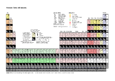
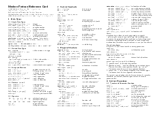
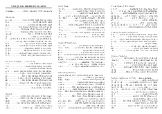
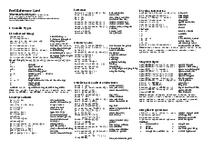
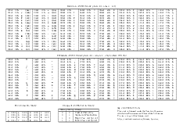

# Refcards

The sources for the following reference cards is on [Github](https://github.com/goerz/Refcards).

<h3 id="periodictable">Periodic Table of Elements</h3>

    

        <a href="periodictable.png">
            </img>
        </a>
    

    

        
Last updated: 2018

        

            Contains atomic weight, mass number for most abundand isotope,
            atomic number, full electron configuration, valence electrons, and nuclear spin
            of most abundant isotope with I≠0.
        

        
PDF: <a href="periodictable-a4.pdf">Periodic Table (A4)</a>&nbsp;
            <a href="periodictable-letter.pdf">(letter)</a>

        
<a href="https://github.com/goerz/Refcards/blob/master/periodictable/periodictable.py">Python script for generating TeX code for the refcard.</a>

    

<h3 id="fortran">Modern Fortran Reference Card</h3>

    

        <a href="fortran_refcard.png">
            </img>
        </a>
    

    

        
Last updated: 2015

        
Reference card for Fortran 90/95, with select features of Fortran 2003/2008.

        
Contents: Data Types, Control Constructs, Program Structure, Intrinsic
        Procedures, Input/Output

        

            PDF: <a href="fortran_refcard_a4.pdf">Modern Fortran Reference Card (A4)</a>&nbsp;
            <a href="fortran_refcard_letter.pdf">(letter)</a>
        

        
TEX: <a href="https://github.com/goerz/Refcards/blob/master/fortran/fortran_refcard.tex">LaTeX code for the refcard.</a>

    

<h3 id="vim">Vim Reference Card</h3>

    

        <a href="vimqrc.png">
            </img>
        </a>
    

    

        
Last updated: 2010

        
Contents: Movements; Insertion &amp; Replace; Deletion; Insert Mode; Search
        &amp; Substitution; Standard Mode Formatting/Filtering; Visual Mode; Undoing;
        Repeating &amp; Registers; Copying; Patterns; Spell Checking; Marks, Motions
        and Tags; Multiple Files / Buffers; Scrolling &amp; Multi-Windowing; Misc Ex
        Commands; Ex Ranges; Completion; Folding, Compiling, Miscellaneous.
        

        
PDF: <a href="vimqrc.pdf">Vim Reference Card (A4)</a>

        
TEX: <a href="https://github.com/goerz/Refcards/blob/master/vim/vimqrc.tex">Plain TeX code for the refcard.</a>

    

<h3 id="python25">Python 2.5 Reference Card</h3>

    

        <a href="python_refcard.png">
            </img>
        </a>
    

    

        
Last updated: 2009

        
Contents: variable types (numbers, sequences, sets, strings and regular
        expressions), basic syntax, object orientation and modules, exception handling,
        system interaction, input/output, standard library

        
PDF: <a href="python_refcard.pdf">Python Reference Card (A4)</a>

        
ODT: <a href="python_refcard.odt">OpenOffice source for reference card</a>

    

<h3 id="perl">Perl Reference Card</h3>

    

        <a href="perl_refcard.png">
            </img>
        </a>
    

    

        
Last updated: 2008

        
Contents: variable types, basic syntax, references and data structures, system
        interaction, input/output, regular expressions, object-oriented perl and
        modules, and one-liners.

        
PDF: <a href="perl_refcard.pdf">Perl Reference Card (A4)</a>

        
ODT: <a href="perl_refcard.odt">OpenOffice source for reference card</a>

    

<h3 id="ascii">ASCII Table</h3>

    

        <a href="ascii.png">
            </img>
        </a>
    

    

        
Last updated: 2009

        
Regular/Latin1 ASCII Table.

        
PDF: <a href="ascii_a4.pdf">ASCII Table (A4)</a>&nbsp;
            <a href="ascii_letter.pdf">(letter)</a>

        
TEX: <a href="https://github.com/goerz/Refcards/blob/master/asciitable/ascii.tex">LaTeX code for the refcard.</a>

    

### Others

The following reference cards are less polished than the above:

* [Vim LaTeX-Suite (incomplete)](vimlatexqrc.pdf) ([TeX](https://github.com/goerz/Refcards/blob/master/vimlatex/vimlatexqrc.tex))
* [My personal vim mappings](my_vim_mappings.pdf) ([TeX](https://github.com/goerz/Refcards/blob/master/my_vim_mappings/my_vim_mappings.tex))
* [Powers of ten](powers_of_ten.pdf) ([TeX](https://github.com/goerz/Refcards/blob/master/powers_of_ten/powers_of_ten.tex))
